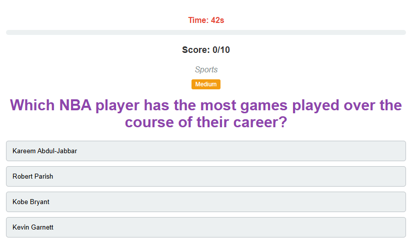
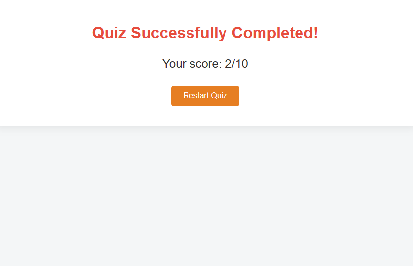

# 🏆 Ultimate Sports Quiz

A dynamic sports trivia web application that tests your knowledge of various sports with 10 challenging questions fetched from the Open Trivia Database API.

<p align="center">
  
</p>

## Features

- 🕹️ Interactive quiz interface with multiple-choice questions
- ⏱️ 60-second timer for added challenge
- 📊 Progress bar to track your advancement
- ✅ Visual feedback for correct/incorrect answers
- 🏅 Score tracking throughout the quiz
- 🔄 Option to restart the quiz after completion
- 📱 Responsive design that works on all devices

## 📸 Screenshots

<div align="center">
  <h3>Start Screen</h3>
  
  
  <h3>Quiz Screen</h3>
  
  
  <h3>End Screen</h3>
  
</div>

## Technologies Used

- HTML5
- CSS3
- JavaScript (ES6)
- Open Trivia Database API

```
https://opentdb.com/api_config.php
```

## 🌟 Play Online Now!

🔗 **Direct Link**:  
[https://moringa-sdf-pt10.github.io/Rowney-Ouma-trivia-project/](https://moringa-sdf-pt10.github.io/Rowney-Ouma-trivia-project/)

## 🎮 How to Play

1. 🏁 Click the "Start Quiz" button
2. 📖 Read each sports question carefully (60s timer!)
3. ✅ Select your answer from 4 options
4. 💡 Immediate feedback shows correct/incorrect answers
5. 🔄 Continue through all 10 questions
6. 🏆 View your final score (X/10)
7. 🔁 Click "Restart Quiz" to try again

_Pro Tip: Answer quickly and accurately to maximize your score!_

## 📦 Installation (Optional for Developers)

### Prerequisites

- [Git](https://git-scm.com/downloads) installed
- Code editor ([VS Code](https://code.visualstudio.com/) recommended)
- Modern web browser (Chrome/Firefox/Edge)

### 🛠️ Installation

#### Clone the Repository

```bash
# Using SSH (recommended)
git clone git@github.com:Moringa-SDF-PT10/Rowney-Ouma-trivia-project.git

# Using HTTPS (alternative)
git clone https://github.com/Moringa-SDF-PT10/Rowney-Ouma-trivia-project.git
```

### 🛠️ Navigate to Project

`cd Rowney-Ouma-trivia-project`

### 🛠️ I📁 Project Structure

```

📦 Rowney-Ouma-trivia-project
├── 📄 index.html          # Main application entry point
├── 📄 styles.css          # All CSS styles
├── 📄 index.js            # Game logic and API calls
└── 📂 assets/
```

### Customizing

- **Modify questions**: Edit the API URL in `index.js`
- **Change styling**: Edit `styles.css`
- **Update timer**: Change `timeLeft` value in `index.js`

---

## 🤝 Contributing

Create your feature branch

```bash
git checkout -b feature/NewFeature
```

Commit your changes

```
git commit -m 'Add some NewFeature'
```

Push to the branch

```
git push origin feature/NewFeature
```

Open a Pull Request

## 📝 License

This project is open-source and licensed under the MIT License.

## ✉️ Contact

[https://moringa-sdf-pt10.github.io/Rowney-Ouma-trivia-project/](https://moringa-sdf-pt10.github.io/Rowney-Ouma-trivia-project/)

## 🙏 Acknowledgments

- [Open Trivia Database](https://opentdb.com/api_config.php) for the API
- Moringa School for guidance
- All contributors ❤️
